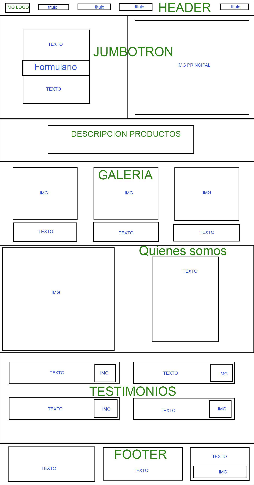

# PROYECTO 1: Landing de Negocio MANOS DEL MARGA-MARGA 

## **ÍNDICE**

* [1. Intro](#1-intro)
* [2. Vinculo](#2-vinculo)
* [3. Descripcion](#3-descripcion)
* [4. Aprendizajes Obtenidos](#4-aprendizajes-obtenidos)

****

## 1. Intro

Este es el repositorio del proyecto de Landing de ventas 
para la primera entrega del curso Desarrollo Web Full Stack del Bootcamp UDD Cohorte 10 2023. 
Es también mi primer proyecto y mi primer repositorio.

Fecha de entrega Sabado 2 de septiembre.

Manos del Marga-Marga  es una PYME localizada en la ciudad de Quilpué, en la V region de Valparaíso, Chile.
Formalizada en 2017, opera desde 2012 como taller de fabricación de papel reciclado artesanal, trabajando en colaboracion con distintos recolectores de base, produce distintos tipos de productos, desde papel imprimible con semillas de flores o de huerta chilena, hasta articulos decorativos de origami como mariposas y troquelados como corazones y circulos para distintos tipos de eventos. Entre otros productos realizan tarjetas de presentación, flayers, credenciales para eventos y pulseras de acreditación.
Han trabajado con importantes empresas de distintos sectores, tanto del rubro de la economía sustentable y otros tipos de comercio como el retail. Actualmente cuenta con 4 trabajadores fijos, en su mayoría mujeres. Y tiene como objetivo el constante crecimiento y la cooperacion con el cuidado del medio ambiente.

****

## 2. Vinculo

Vinculo para visualizar la Pagina Web: 
[Enlace] (https://pepeoawvh.github.io/Proyecto1MMM/)

****

## 3. Descripcion

Este proyecto consiste en la construcción de una página web que funcione como Landing de Ventas 
para el Taller de papel reciclado artesanal Manos del Marga-Marga.
La pagina web está construida en HTML y CSS, tiene como objetivo generar un espacio de promoción para los productos de la linea de bodas de esta empresa, de manera sencilla y atractiva.

Para la construcción del sitio, se utilizó la estructura básica del ejemplo dado en la pauta del proyecto, considerando también la imagen corporativa de la empresa y la obersvación de distintos sitios orientados a la venta de servicios y productos para bodas.

Para la ideación del sitio se generó un prototipado simple que se muestra a continuación:

- Contiene las siguientes secciones:
  - **a. Header**:
    Sección que involucra el logo y las áreas principales del sitio.
  - **b. Jumbotron**:
    Sección de presentación del producto al usuario. Incluye título y formulario con boton para entrega de correo electrónico.
  - **c. Blog o catálogo**:
    Sección de presentacion de productos y servicios mediante tarjetas.
  - **d. Adicionales**:
    Sección con testimonios de clientes que contrataron servicios o compraron productos.
  - **e. Footer**:
    Sección que incluye todas las áreas del sitio, incluyendo redes sociales.

****

## 4. Aprendizajes Obtenidos

Durante el tiempo de realización del proyecto logré adquirir y aplicar conocimientos sobre HTML y CSS.

Sobre HTML aprendí a:

- Crear etiquetas html5.
- Utilizar atributos dentro de estas etiquetas
- Construir listas ordenadas y no ordenadas.
- Incluir imágenes y enlaces en el documento.
- Dar formato a textos, entre otros.

Sobre CSS aprendí a:

- Aplicar propiedades css básicas.
- Establecer los valores de las propiedades css.
- Estilos visuales usando clases.
- Diseñar páginas responsive.
- Usar media queries para adaptarse a distintos dispositivos.
- Obtuve nociones sobre la utilización de bootstrap y su uso para crear diseños responsive.
__________

- Además aprendimos a utilizar Git Hub Pages para poder generar un repositorio y obtener un enlace.
- Aprendí a generar prototipos simples.

****
## 5. Conclusiones

El desarrollo del proyecto me ha permitido tener experiencia en el manejo de herramientas básicas de desarrollo web.
También obtuve una mayor claridad acerca de como funcionan algunas tecnologías web que anteriormente desconocía completamente (como el uso de git y github).
El trabajo fue muy interesante ya que me permitió tener una experiencia práctica en desarrollo web desde cero y con un objetivo claro.